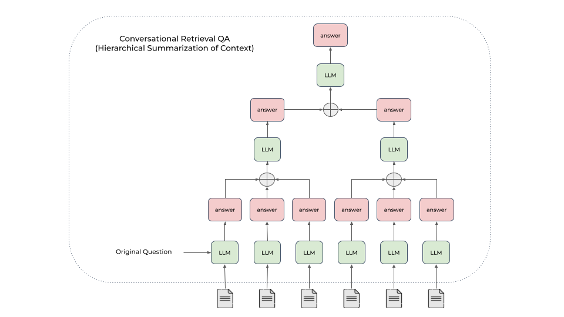

# RAG (Retrieval-augmented generation) ChatBot

[](https://github.com/Tirth1411/rag-chatbot/actions/workflows/ci.yaml)
[](https://github.com/pre-commit/pre-commit)
[](https://github.com/astral-sh/ruff)

Check out the todo list to see the next steps and improvements planned for this project [here](notes/todo.md).

> [!IMPORTANT]
> Disclaimer:
> The code has been tested on:
> * Ubuntu 22.04.2 LTS running on a Lenovo Legion 5 Pro with twenty 12th Gen Intel Core i7-12700H and an NVIDIA GeForce RTX 3060.
> * MacOS Sonoma 14.3.1 running on a MacBook Pro M1 (2020).
>
> If you are using another Operating System or different hardware, and you cannot load the models, please take a look at the official llama.cpp GitHub issues.

> [!WARNING]
> It is important to note that the large language model sometimes generates hallucinations or false information.

## Table of contents

- [Introduction](#introduction)
- [Prerequisites](#prerequisites)
    - [Install Poetry](#install-poetry)
- [Bootstrap Environment](#bootstrap-environment)
    - [How to use the make file](#how-to-use-the-make-file)
    - [Environment](#environment)
    - [Set the Open-Source LLM Model](#set-the-open-source-llm-model)
    - [Set the Embedding Model](#set-the-embedding-model)
    - [Set the Response Synthesis strategy](#set-the-response-synthesis-strategy)
- [Build the memory index](#build-the-memory-index)
- [Run the Chatbot](#run-the-chatbot)
- [References](#references)

## Introduction

This project combines the power of llama.cpp and Chroma to build:

* a Conversation-aware Chatbot (ChatGPT like experience).
* a RAG (Retrieval-augmented generation) ChatBot.

The RAG Chatbot works by taking a collection of Markdown files as input and, when asked a question, provides the corresponding answer based on the context provided by those files.


> [!NOTE]
> I have refactored the RecursiveCharacterTextSplitter class from LangChain to effectively chunk Markdown files without adding LangChain as a dependency.

The Memory Builder component of the project loads Markdown pages from the docs folder. It then divides these pages into smaller sections, calculates the embeddings (a numerical representation) of these sections with the Semantic Search models from Sentence Transformers, and saves them in an embedding database called Chroma for later use.

When a user asks a question, the RAG ChatBot retrieves the most relevant sections from the Embedding database. Since the original question cannot always be optimal to retrieve for the LLM, we first prompt an LLM to rewrite the question, then conduct retrieval-augmented reading. The most relevant sections are then used as context to generate the final answer using a local language model (LLM). Additionally, the chatbot is designed to remember previous interactions. It saves the chat history and considers the relevant context from previous conversations to provide more accurate answers.

To deal with context overflows, two approaches are implemented:

* Create And Refine the Context: synthesize responses sequentially through all retrieved contents.
    * 
* Hierarchical Summarization of Context: generate an answer for each relevant section independently, and then hierarchically combine the answers.
    * 

The Memory Builder builds the vector database in an incremental way, which means that when a document changes, we only update the corresponding chunks in the vector store instead of rebuilding the whole index.

This is achieved through:
- Document-level metadata tracking: every chunk gets tagged with a source doc ID + version hash. When a doc changes, we regenerate chunks for that doc only, delete the old ones by metadata filter, and insert new ones. This is significantly more efficient than rebuilding the whole index.
- Incremental ingestion pipeline: the pipeline diffs source docs against what is already indexed (using version hashes). Only changed or new docs get processed.
- Handling deletions: a separate mapping table (doc_id -> chunk_ids) is maintained in a SQLite db to precisely target what to remove without scanning the whole store.

> [!IMPORTANT]
> If you ever swap embedding models, you must rebuild the index from scratch since the vector spaces will not be compatible.

## Prerequisites

* Python 3.12+
* GPU supporting CUDA 12.4+ or Apple Silicon M-series
* Poetry 2.3.0+
  * See [notes/poetry.md](notes/technical/poetry.md#install-poetry).
* Docker 24.0.6+ and Docker Compose 5.0.2+
* NVIDIA Container Toolkit installed (optional, for CUDA support)
  * See [notes/llama-server-docker.md](notes/technical/llamacpp/server-docker.md#installing-nvidia-container-toolkit).

For the UI:
* Node 22.12+
* Yarn 1.22+

## Bootstrap Environment

To easily install the dependencies and start the services, use the provided make file.

### How to use the make file

> [!IMPORTANT]
> Run Setup as your init command (or after Clean).

* Check: `make check`
    * Use it to check that which pip3 and which python3 points to the right path.
* Setup:
    * Setup with NVIDIA CUDA acceleration: `make setup_cuda`
        * Creates an environment and installs all dependencies with NVIDIA CUDA acceleration.
    * Setup with Metal GPU acceleration: `make setup_metal`
        * Creates an environment and installs all dependencies with Metal GPU acceleration for macOS systems.
    * Both start the llama.cpp server locally via Docker compose.
* Start: `make start`
    * Start both the backend and frontend ensuring that the backend is running and ready before launching the frontend.
* Start llama.cpp server
    * on CUDA: `make start_llama_server_cuda`
    * on Metal: `make start_llama_server_metal`
    * Start the llama.cpp server locally via Docker compose.
    * It will be available at http://0.0.0.0:8080 (it will show the llama-ui).
* Stop llama.cpp Server: `make stop_llama_server`
    * Stop the llama.cpp server if it is running locally.
* Update: `make update`
    * Update an environment and installs all updated dependencies.
* Tidy up the code: `make tidy`
    * Run Ruff check and format.
* Clean: `make clean`
    * Removes the environment and all cached files.
* Test: `make test`
    * Runs all tests using pytest.

### Environment

Copy .env.example -> .env and fill it in.

Copy /frontend/.env.example -> .env and fill it in.

To install the UI dependencies, run:

```shell
cd frontend
nvm use
npm install -g yarn
yarn

# Create .env file
echo "VITE_API_URL=http://localhost:8000" > .env
```

### Set the Open-Source LLM Model

llama-cpp serves as a C++ backend designed to work efficiently with transformer-based models, which runs either on a CPU or GPU. It uses quantized models which are stored in GGUF format.

You can load any GGUF model from HuggingFace.

In the .env file, set the MODEL variable with the name of the model and the MODEL_URL variable with the URL of the model in GGUF format:
```
MODEL="Meta-Llama-3.1-8B-Instruct-Q4_K_M"
MODEL_URL="https://huggingface.co/bartowski/Meta-Llama-3.1-8B-Instruct-GGUF/resolve/main/Meta-Llama-3.1-8B-Instruct-Q4_K_M.gguf"
```

> [!IMPORTANT]
> The Chatbot must be restarted after changing the model.

The chosen model will be downloaded in the /models folder and loaded in the llama.cpp server.

### Recommended Models

| Model                       | Model Size         | Max Context Window | Notes                                                                                                                        |
|-----------------------------|--------------------|--------------------|------------------------------------------------------------------------------------------------------------------------------|
| Qwen 3.6 27B                | 27B                | 262k               | Recommended model                                                                                                            |
| Qwen 3.6 35B A3B            | 35B (3B activated) | 262k               | MoE architecture                                                                                                             |
| Qwen 3.5 0.8B               | 0.8B               | 256k               | Tiny and fast multimodal, great for edge devices                                                                             |
| Qwen 3.5 2B                 | 2B                 | 256k               | Multimodal for lightweight agents                                                                                            |
| Qwen 3.5 4B                 | 4B                 | 256k               | Balanced performance                                                                                                         |
| Qwen 3.5 9B                 | 9B                 | 256k               | Recommended model for complex tasks                                                                                          |
| Meta Llama 3.2 Instruct     | 1B                 | 128k               | Optimized for mobile or edge devices                                                                                         |
| Meta Llama 3.2 Instruct     | 3B                 | 128k               | Optimized for mobile or edge devices                                                                                         |
| Meta Llama 3.1 Instruct     | 8B                 | 128k               | Reliable baseline model                                                                                                      |
| DeepSeek R1 Distill Qwen 7B | 7B                 | 128k               | Experimental reasoning model                                                                                                 |

### Set the Embedding Model

For semantic search, the project supports embedding models from Sentence Transformers.

In the .env file, set the EMBEDDING_MODEL variable:
```
EMBEDDING_MODEL="all-MiniLM-L6-v2"
```

| Embedding Model                                   | Supported | Model Size | Max Tokens | Retrieval score (MTEB) |
|---------------------------------------------------|-----------|------------|------------|------------------------|
| all-MiniLM-L6-v2                                  | Yes       | 0.023B     | 512        | 33.30                  |
| all-MiniLM-L12-v2                                 | Yes       | 0.033B     | 256        | 33.37                  |
| all-mpnet-base-v2                                 | Yes       | 0.109B     | 384        | 33.80                  |
| jinaai/jina-embeddings-v5-text-small-retrieval    | Yes       | 0.596B     | 32k        | 64.88                  |
| jinaai/jina-embeddings-v5-text-nano-retrieval     | Yes       | 0.212B     | 8k         | 63.26                  |

### Set the Response Synthesis strategy

In the .env file, set the SYNTHESIS_STRATEGY variable:
```
SYNTHESIS_STRATEGY="tree-summarization"
```

| Response Synthesis strategy           | Supported | Notes             |
|---------------------------------------|-----------|-------------------|
| create-and-refine                     | Yes       | Sequential refine |
| tree-summarization                    | Yes       | Recommended       |


## Build the memory index

To build the memory index, place your Markdown files under docs and run:

```shell
make migrate_db
cd scripts && PYTHONPATH=.:../backend python memory_builder.py --model-name jinaai/jina-embeddings-v5-text-small-retrieval --chunk-size 1000 --chunk-overlap 50
```

## Run the Chatbot

The Chatbot has a UI built with Vite, React and TypeScript, and a backend built with FastAPI that serves the LLMs through the llama.cpp server.

To start both the backend and frontend:

```shell
make start
```

The application will be available at http://localhost:5173, with the backend API at http://localhost:8000.


Enable the RAG Mode feature in the UI to ask questions based on the indexed context:


## References

* Large Language Models (LLMs):
    * LLMs as a repository of vector programs
    * GPT in 60 Lines of NumPy
    * Calculating GPU memory for serving LLMs
    * Introduction to Weight Quantization
* LLM Frameworks:
    * Deepval - A framework for evaluating LLMs
    * Structured Outputs (Outlines)
* Agents:
    * Building effective agents
    * PydanticAI
* Vector Databases:
    * Nearest Neighbor Indexes for Similarity Search
    * Hierarchical Navigable Small World (HNSW)
    * Chroma and Qdrant
* Retrieval Augmented Generation (RAG):
    * Building A Generative AI Platform
    * Rewrite-Retrieve-Read
    * Conversational awareness

## Maintainer

This project is maintained by Tirth Laheri, a Software Developer with over 3 years of experience in Python, Java, and Machine Learning frameworks. I focus on building efficient, local-first AI solutions and optimizing RAG pipelines.

* GitHub: [github.com/Tirth1411](https://github.com/Tirth1411)
* LinkedIn: [linkedin.com/in/tirthlaheri](https://linkedin.com/in/tirthlaheri)
* Email: tirthlaheri@gmail.com